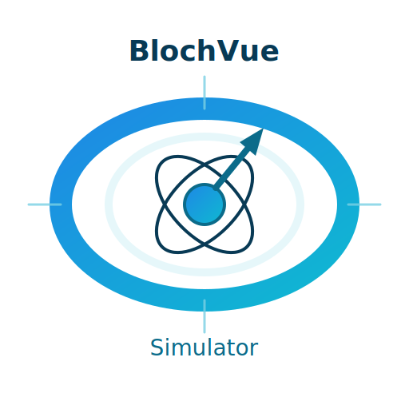

<div align="center">



# BlochVue-simulator


<p>Vue 版本的 Bloch Simulator，用于 MRI / NMR 磁共振的可视化模拟，供教学、演示与自学使用。</p>

</div>

---

## 在线演示

- [GitHub Pages](https://s1yh0pper.github.io/BlochVue-simulator/)

## 快速开始

### 环境要求

- Node.js 20+
- 支持 WebGL 的现代浏览器

### 安装与运行

```bash
# 克隆项目
git clone https://github.com/s1YH0pper/BlochVue-simulator.git
cd BlochVue-simulator

# 安装依赖
npm ci

# 启动开发服务器
npm run dev

# 构建生产版本
npm run build

# 预览生产构建
npm run preview
```

## 使用说明

### 场景切换

- 点击"预设"下拉菜单选择不同场景
- 支持进动、平衡态、不均匀场、混合物质等场景
- 切换时会弹出确认对话框

### 保存与恢复

- “保存场景”：将当前状态快照保存
- “恢复场景”：恢复到最近一次保存的快照（弹出确认）
- 切换场景后按钮重置为“保存场景”，避免误导

### 动画控制

- 点击"||"暂停动画
- 点击"▶"恢复动画

### 脉冲操作

- 强/弱脉冲：90°ₓ、90°ʸ、80°ₓ、30°ₓ、30°ʸ、sinc 等
- 重聚焦：180°ʸ、180°ₓ、160°ʸ、160°ₓ
- 扰相/梯度：扰相、Gx/Gy 脉冲/再聚焦
- 重复激发：若干预置 TR 方案与序列组合

## 性能说明

- 建议在性能较好的设备上运行

## 浏览器兼容性

- Chrome 90+
- Firefox 88+
- Safari 14+
- Edge 90+

## 常见问题

### 页面显示空白

- 检查浏览器是否支持 WebGL
- 尝试刷新页面或重启浏览器

### 平面场景卡顿

- 这是正常现象，系统会自动优化
- 可以尝试切换到其他场景

### 按钮未响应

- 请检查控制台报错与浏览器兼容性

## 问题报告

提交 Issue 时请包含：

- 操作系统和浏览器版本
- 重现步骤
- 预期行为
- 实际行为
- 错误截图（如有）

## 开发指南

### 技术栈

- **Vue 3.5.18** - 渐进式 JavaScript 框架
- **Three.js 0.180.0** - 3D 图形库
- **Element Plus 2.11.2** - Vue 3 UI 组件库
- **Pinia 3.0.3** - Vue 状态管理
- **Vite 7.0.6** - 构建工具
- **dat.GUI 0.7.9** - 参数控制面板

### 项目结构

```
src/
├─ components/
│ ├─ SceneManager.vue       # Three.js 场景/渲染管理，resize 防抖
│ ├─ ControlPanel.vue       # dat.gui 面板构建与更新
│ ├─ FIDChart.vue           # FID 曲线绘制（设备像素比/抽样优化）
│ ├─ UIEvents.vue           # 菜单/按钮、确认对话框、动画暂停
│ └─ ConfigSplitButton.vue  # 可复用分裂按钮
├─ Physics/
│ ├─ BlochCore.js           # 核心物理：脉冲、弛豫、步进
│ ├─ BlochRender.js         # 渲染更新（重载场景优化、向量复用）
│ └─ BlochScenes.js         # 预设场景与等向体生成
├─ stores/
│ └─ state.js               # Pinia：state/appState（保存/恢复、定时器）
├─ composables/
│ ├─ useSampleManager.js    # 场景切换、批量移除、FID 标签控制
│ └─ useUIEvents.js         # 命令分发（脉冲/扰相/重复激发/保存恢复）
├─ manager/
│ └─ AnimationManager.js    # RAF 循环（fpsInterval 控制）
├─ utils/
│ └─ index.js               # 几何工具（圆柱/阴影网格）
└─ config/
└─ index.js                 # 全局 CONFIG/COLORS/VECTORS
```

### 添加新场景

1. 在 `src/Physics/BlochScenes.js` 中定义场景函数
2. 在 `src/composables/useSampleManager.js` 中添加 case
3. 在 `src/components/UIEvents.vue` 中添加选项

### 添加新脉冲

1. 在 `src/Physics/BlochCore.js` 中定义脉冲函数
2. 在 `src/composables/useUIEvents.js` 中添加处理逻辑
3. 在 UI 中添加对应按钮

## [更新日志](CHANGELOG.md)

## 许可证

[GPLv3 License](LICENSE)

## 致谢

基于原始 [Bloch Simulator](https://github.com/larsh957/Bloch-Simulator) 项目，使用 Vue 3 重新实现。
